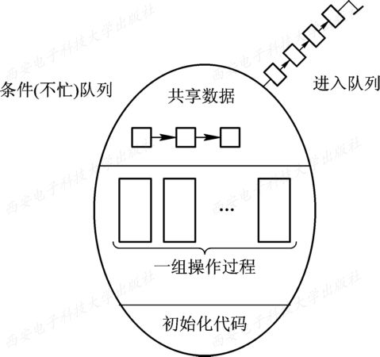
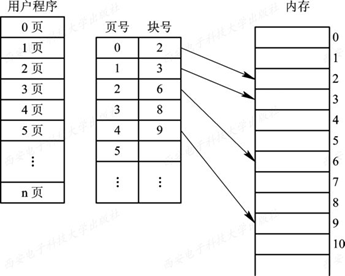
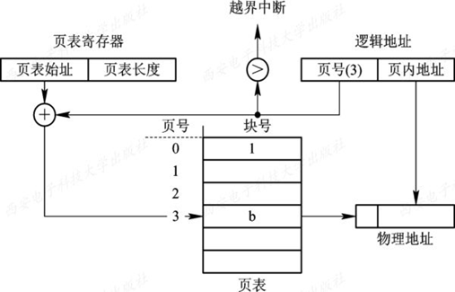
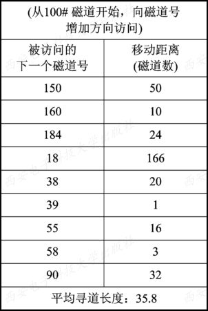
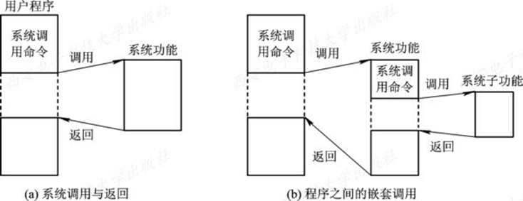
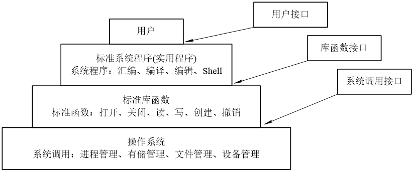

# 计算机操作系统
**作者：Hongtauo**
**Link：https://github.com/Hongtauo/Computer_Operating_Systems_Course**
## 第一章 操作系统引论（概念考察）
### 1.1 操作系统的目标和作用
#### 目标
1. 方便性　　 2. 有效性　　 3. 可扩充性　　 4. 开放性
#### 作用
+ OS作为用户与计算机硬件系统之间的接口
+ OS作为计算机系统资源的管理者
+ OS实现了对计算机资源的抽象

### 1.2 操作系统的发展过程
### 1.3  操作系统的基本特性
#### 特征
1.并发
+ 并发与并行的不同点：
    + 并发的概念是针对单核CPU提出的，指的是在宏观上同一时间段同时运行，在微观上交替执行
    
    + 并行值得是两个或者多个事件在同一时刻内同时发生
    

2.共享
+ 共享指的是系统中的资源可以提供内存中多个并发的进程同时使用
+ 共享的两种方式
    + 互斥共享方式
    + 同时共享方式

3.虚拟
+ 虚拟是通过某种技术把一个物理实体变为若干个逻辑上的对应物

4.异步（不确定性）
+ 异步的不确定性体现在
    + 进程是以人们不可预知的速度向前推进的
    + 导致出现竞争资源

### 1.4  操作系统的主要功能
#### 操作系统的新功能
+ 处理机管理
+ 存储器管理
+ 设备管理
+ 文件管理
+ 提供用户接口
#### 现代操作系统的新功能
+ 系统安全
+ 网络功能
+ 支持多媒体

### 1.5  OS结构设计
#### 传统操作系统结构
+ 无结构操作系统
+ 模块化结构OS
+ 分层式结构OS

#### 客户/服务模式
#### 面向对象程序设计
#### 微内核OS结构

## 第二章 进程的描述与控制
### 进程

#### 1、进程的基本概念
+ 进程的定义
    + 进程是一个程序一次运行的过程
    + 可并发执行的程序在一个数据集合上的一次运行过程，是系统进行资源分配和调度的一个独立单位。
+ 进程的两个基本属性
    + 进程是一个拥有资源的独立单位
    + 进程同时又是一个可独立调度和分派的基本单位，一个进程要能独立运行，它还必须是一个可独立调度和分派的基本单位

#### 2、进程的特征
| 性质 | 说明 |
| -- | -- |
| 动态性 | 进程最基本的特征 |
| 并发性 | 程序在建立进程后并发运行 |
| 独立性 | 是系统进行资源分配和调度的独立单位 |
| 异步性 | 进程以不可预知的速度向前推进 |

#### 3、进程的结构组成
+ 由可执行的程序段、相关数据结构、栈、PCB组成

#### 4、进程的状态及转换
+ 进程的状态（前三种为基本状态）
    + 就绪状态
    + 运行状态
    + 阻塞状态
+ 五态模型

+ 进程的基本状态之间的转换与五种状态间的转换
    + 三种基本状态间的转换
    

    + 五种状态间的转换
    

#### 5、进程的控制
进程的控制通过PCB进程控制块实现
+ 进程的组成

    + 程序、数据
        + 程序与数据是描述此进程需要完成的操作以及功能
    + 栈
        + 保存过程调用的信息：返址、参数传递、局部变量
    + PCB（进程控制块）
        + 是系统为了管理进程设置的一个专门的数据结构
        + 记录进程的动态特征、该进程与系统资源的相关关系
    
+  PCB（进程控制块）的内容
    + 进程标识信息（标识信息）
    + 处理机信息（现场信息）
    + 进程调度信息（说明信息）
    + 进程控制信息（管理信息）
+ 进程控制块的功能
    + 创建
    + 终止
    + 转换

#### 6、进程的同步与通信
+ 进程同步的基本概念
    + 什么是进程同步
        + 把异步环境下的一组并发进程因直接制约而互相发送消息、进行互相合作、互相等待，使得各进程按一定的速度执行的过程称为进程间的同步
    + 为什么要引入进程同步的概念
        +  在多道程序的执行过程中，程序与程序是并发执行的，并发进程之间的间接制约关系与进程互斥，为了协调进程之间的相互制约的关系
    + 间接制约关系
        + 相互竞争资源，产生了制约关系
    + 临界资源
        + 一次仅允许一个进程使用的资源称为临界资源。诸进程间应采取互斥方式，实现对这种资源的共享。
        + 临界资源的类别
            + 硬件
                + 输入机、打印机、磁带机
            + 软件
                + 共用变量、数据、表格、队列
    + 互斥（互斥的定义）
        + 对于某个临界资源，当一个进程正在使用他的时候，其他的进程必须等待直至该资源空闲，在等待的过程中不能使用他
    + 临界区
        + 在进程当中访问临界资源的代码
+ 同步机制
    +  同步机制应当要遵循的原则
    能够实现使进程互斥的访问自己的临界区，可以通过软件的方法实现，但是更多的会采用硬件进行限制，即是在系统中设置专门的同步机构来协调各进程间的运行
        + 空闲让进
        + 忙则等待
        + 优有限等待
        + 让权等待
    + 同步机制的类别
        + 硬件同步机制
            + 关中断
            + 借助硬件指令“Test and Set”（测试并建立）实现
            + 借助Swap（对换）指令实现
        + 信号量同步机制
            + 整型信号量
            + 记录型信号量
            + AND型信号量
            + 信号量集
        + 管程机制
            + 管程的定义
                + 管程是一个资源管理模块
                + 管程是由共享的数据结构和对该数据结果管理程序所组成的
                
                + 管程由四部分组成
                    + 管程的名称
                    + 对于部分在管程当中的共享数据的结构说明
                    + 对该数据结构操作的方法和过程
                    + 设置部分在管程当中的共享数据初始值的语句
            + 管程的条件变量
            在利用管程进行同步的时候，要设置同步工具，例如要设置两个同步操作原语：wait和signal。
            + wait：当进程通过管程申请获得临界资源但是未得到满足的时候，管程调用wait原语使该进程进入等待状态，并且将它放到等待队列上
            + signa：当该资源被其他占用的程序释放的时候，管程调用signal原语唤醒等待队列中队首的进程使之访问临界资源

+ 进程的通信
    + 进程通信的定义
        + 进程通信是指进程之间的信息交换
    + 进程通信的分类
        + 低级的进程通信
            + 在进程间的互斥同步的过程中，需要交换一些信息，这些信息通过OS为进程提供的共享存储器进行交换，对用户完全透明，而且因为生产者/消费者每次只能从缓冲池中投放/获取一个消息，导致效率低下
        + 高级的进程通信
            + 操作系统提供了一套高效的通信机制，能够实现大量信息的传送，同时该机制是通过操作原语完成的，已经编程好，用户只需要调用即可，而通信过程是完全对用户透明的，用户不需要了解具体的通信实现细节，大大地降低了操作难度，提高了信息交换的效率，减少了程序编制过程中的难度
    + 产生进程通信的原因
        + 进程间互斥同步，需要进程与进程之间交换一定的信息
    + 进程通信的类型
        + 共享存储器
            + 基于共享数据结构的通信方式
            + 基于共享存储区的通信方式
        + 管道通信系统
            + 连接读进程与写进程之间的一个共享文件（pipe文件）能够通过管道的形式传输字符流，为了协调通信，管道机制必须确保以下三个方面
                + 互斥
                + 同步
                + 确定对方存在
        + 消息传递系统
            + 将需要通信的信息放在格式化的消息单位组成的消息当中，通过操作系统提供的一组原语操作，在进程间进行消息传递，完成进程间的数据交换
            + 两类消息传递系统
                + 直接通信方式
                + 间接通信方式
        + 客户机-服务器系统
    + 消息传递通信的实现方式
    + 进程通信的目的
        + 数据传输
        + 资源共享
        + 通知事件
        + 进程控制

#### 7、进程与程序的区别
+ 进程是程序处理数据的过程，而程序是一组指令的有序集合
+ 进程具有动态性、并发性、独立性、异步性，而程序不具备这些功能
+ 进程拥有数据结构
+ 进程与程序并非一一对应，一个程序可以对应多个进程，一个进程可以执行多个程序

### 线程
#### 1、线程的基本概念
+ 线程的引入
为了减小程序在并发执行中的时空开销，提高系统的并发效率，使得系统拥有更好的并发性
#### 2、线程与进程的比较
| 比较 | 进程 | 线程 |
| -- | -- | -- | 
| 进程调度的基本单位 | 在传统的操作系统当中，进程作为独立调度与分配的基本单位 | 在引入线程的操作系统当中，线程变成了资源调度与分配的基本单位 |
| 并发性 | 进程与进程之间可以进行并发 | 进程内的各线程之间也可以进行并发，提高并发性 |
| 拥有的资源 | 进程可以拥有资源，并作为系统中拥有资源的一个基本单位 | 线程拥有少量能保证独立运行的资源， 而且还允许多个线程共享资源|
| 独立性 | 同一个进程间的线程独立性低，他们共享程序中的地址空间和资源 | 不同进程之间相互独立，各自拥有独立地址空间与资源，不允许其他进程的访问 |
| 系统开销 | 系统开销大，在创建和回收进程的时候，系统需要分配与回收PCB与资源 | 系统开销小，不涉及到PCB的分配与回收，线程间的切换更加轻量级 |
| 支持多处理机器系统 | 单线程进程在多处理机系统中只能运行在一个处理机上 | 多线程进程在多处理机系统中能够在不同处理机上并发运行，提高效率，加速进程完成 |
#### 3、线程的实现（了解即可）

## 第三章 处理机调度与死锁（计算题）

### 调度
在多道程序系统中，调度实际上是对资源的一种分配，处理机调度就是对处理机资源进行的分配
#### 1、调度的定义以及常见的调度算法
+ 处理机调度的层次
    + 高级调度（作业调度（长程调度））
    
        + 考虑的问题（主要任务）
            + 接纳多少个作业
            + 接纳哪些作业

    + 中级调度（内存调度）
    
        + 引入中级调度的目的
            + 为了提高内存的利用率与系统吞吐量
        + 考虑的问题
            + 交换哪些进程
            + 什么时候交换进程

    + 低级调度（进程调度）
    
        + 考虑的问题
            + 调度标准
            + 调度时机

#### 2、作业调度
+ 作业的概念
    + 作业（job）
    在操作系统中，作业是用户提交给系统的一项相对独立的工作。
    + 作业控制块（JCB）
        + 作业标识
        + 用户名称
        + 用户账号
        + 作业类型
            + CPU繁忙型
            + I/O繁忙型
            + 批量型
            + 终端型
        + 作业状态
        + 调度信息
            + 优先级
            + 作业运行时间
        + 资源需求
            + 运行时间
            + 要求内存大小
        + 资源使用情况
    + 作业运行的三个阶段各三种状态
        + 三个阶段
            + 收容阶段
            + 运行阶段
            + 完成阶段
        + 三种状态
            + 后备状态
            + 运行状态
            + 完成状态

+ ==调度算法==
    + 处理机调度算法的共同目标
        + 资源利用率
        + 公平性
        + 平衡性
        + 策略强制执行
    + 调度算法
        + 先来先服务（FCFS）
            + 忽略作业的执行时间
            + 将后备作业队列中选择几个最早进入该队列的作业调入内存，为他们分配资源和创建进程，然后送入到就绪队列中
        + 短作业优先（SJF）
            + 系统计算各个作业执行所需要的时长
            + 作业执行所需==时间越短==，优先级越高
        + 优先级调度（HRRN）
            + 高响应比优先调度
                + 优先级定义：
                
                等价于
                

#### 3、进程调度
+ 概念
    + 进程调度的任务、机制、方法
        + 任务
            + 保存处理机的现场信息
            + 按照某种算法选取进程
            + 把处理器分配给进程
        + 机制
        为了实现进程调度，进程调度的机制应当由以下三个部分组成
            + 排队器
            + 分派器
            + 上下文切换器
            

        + 方式
            + 抢占式方式
            系统会强制剥夺目前占用CPU的程序的CPU资源，将CPU资源分配给其他进程运行
                
            + 非抢占式方式
            一旦进程占用CPU就一直运行，直到该进程终止

            + 抢占原则
                + 时间片原则
                + 优先权原则
                + 剩余时间原则
            + 抢占实现机制
                + 内核完全可抢占
                    + solaris
                    + win2000
                + 内核部分可抢占
                    + unixSVR4
                    + linux
                + 内核完全不可抢占
                    + winNT
                    + 传统unix
        
        + 可能的进程调度时机
            + 分时系统中的时间片用完
            + 当前进程本身状态发生转换
            + 进程从系统调用返回用户态
            + 系统从中断处理中返回用户态
            + 就绪队列中出现比当前程序优先级更高的程序

+ 算法
    + 轮转调度算法
    + 优先级调度算法
    + 多队列调度算法
    + 多级反馈队列
    + 保证调度算法
    + 公平分享调度算法
#### 4、实时调度
+ 实时调度的基本条件
    + 提供必要信息
    + 系统处理能力强
    + 采用抢占式调度机制
    + 具有快速切换机制

+ 实时调度算法的分类
    + 根据实时任务性质分类
        + 硬实时调度算法
        + 软实时调度算法
    + 根据调度方式分类
        + 非抢占式调度算法（用于非周期实时任务）
            + 非抢占式轮转调度算法
            + 非抢占式优先调度算法
        + 抢占式调度算法（用于周期实时任务）
            + 基于时钟中断的优先级调度算法
            + 立即抢占的优先级调度算法

### 死锁
#### 1、死锁的概念
 一组进程中，每个进程都无限等待被该组进程中另一进程所占有的且永远无法释放的资源，这种现象称为进程死锁，这一组进程就称为死锁进程。

#### 2、死锁的原因以及必要条件
+ 原因
    + 竞争资源
    + 进程推进顺序不当
+ 必要条件
    + 互斥条件
    + 请求和保持条件
    + 不可剥夺条件
    + 环路等待条件（使用按顺序申请资源可以破坏此条件）

#### 3、解决死锁问题
+ 预防死锁
    + 破坏占有且等待条件
        + 静态分配资源
        + 要求进程在没有资源可用的情况下才申请资源
    + 破坏不可剥夺条件
        + 有则分配
        + 无则等待
    + 破坏环路等待条件
        + 采用按顺序分配资源的策略
+ 避免死锁（银行家算法）
避免程序运行处在不安全状态
    + 安全状态
    设系统中有n个进程，若存在一个进程序列<P1，P2，…，Pn>。使得进程Pi （i=1,2，…，n）以后还需要的资源可以通过系统现有空闲资源加上所有Pj（j<i）已占有的资源来满足，则称此时系统处于安全状态，进程序列<P1，P2，…，Pn>称为安全序列，因为各进程至少可以按照安全序列中的顺序依次执行完成。如果系统无法找到这样一个安全序列，则称系统处于不安全状态。       

+ 死锁的检测与接触死锁
    + 死锁的检测算法
    + 死锁的解除算法

### 计算题
#### 例题1：在银行家算法中，若出现下述资源分配情况，试问

1、该状态是否安全
若能够找到一个安全序列，则证明该状态安全
+ 将Available空间分配给P0，P0的Need<Available，可以分配，等P0结束后，将资源全部释放，此时Available为1 6 5 4 
+ 将Available空间分配给P3，P3的Need<Available，可以分配，等P3结束后，将资源全部释放，此时Available为1 9 8 6
+ 将Available空间分配给P4，P4的Need<Available，可以分配，等P4结束后，将资源全部释放，此时Available为1 9 9 10
+ 将Available空间分配给P1，P1的Need<Available，可以分配，等P1结束后，将资源全部释放，此时Available为2 9 9 10
+ 将Available空间全部分配给最后一个进程P2，P2的Need<Available，可以分配，此时找到了一个安全序列{P0,P3,P4,P1,P2}故此状态安全

2、若进程P2提出请求Request(1, 2, 2, 2)后，系统能否将资源分配给它? 
如果进程P2能被满足且满足P2后系统不会进入不安全状态，则可以分配资源给他
+ Request<Need and Request<Available
+ 将Available空间分配（1，2，2，2）给P2后，Available为0 4 0 0，P2的Need为1 1 3 4 ，此时Available无法满足剩下任何一个进程的Need，此时系统进入不安全状态

#### 例题2：假设某系统有同类资源12个，有三个进程P1，P2，P3来共享，已知P1、P2、P3所需要资源总数分别为8，6，9，它们申请资源的次序和数量如下表所示，系统采用银行家算法为它们分配资源。

1、哪次申请分配会使系统进入不安全状态？ 
答：在第四次分配后会使得系统进入不安全状态
2、执行完序号为6的申请后，各进程的状态和各进程已占用的资源数？ 
答：如果能够执行序号六，意味着执行序号六前的序列均为安全序列，通过计算，先执行前三次申请，剩下2个可用资源，此时进程P2还需要2个资源即可完成工作，于是执行序号为6的申请，将系统剩余的2个资源分配给进程P2，P2结束并释放6个资源，系统可用资源数为6，此时进程P1和P3分别还需要4个和7个资源，将系统可用资源分配给P1后，P1结束，释放8个资源，系统可用资源增加至10个，满足进程P3的需要，从而使得P1，P2，P3均能完成。

## 第四章 存储器管理（计算题）    

### 存储器的基本概念
#### 1、存储器层次

####  2、地址映射
+ 物理地址
物理地址又叫做实地址/绝对地址，物理地址的集合叫做主存空间
+ 逻辑地址
逻辑地址又叫做相对地址/虚地址，逻辑地址的集合叫做用户程序的空间
+ 地址映射
将程序地址空间中使用的逻辑地址变换成主存中的物理地址的过程，称为地址映射。

### 连续分配存储管理方式
#### 1、分配
+ 单一连续分配
+ 固定分区分配
+ 动态分区分配
    + 分配算法
        + 首次适应法
            + 将程序装入到主存中足够装入的最低地址空闲区
            + 空闲区按照地址由低到高排序
            + 尽量利用主存低地址空闲区，在高地址保留大空闲区
            

        + 最佳适应法
            + 将程序装入到主存中与其大小最接近的空闲区
            + 空闲区内按照大小由小到大排序
            + 尽量利用存储器中小的空闲区，保留较大的空闲区
            

        + 最坏适应法
            + 将程序装入到主存中与其大小差距最大的空闲区当中
            + 尽量利用存储器中的大的空闲区，使其他剩余的空闲区较大
            
#### 2、回收
+ 回收算法
四种情况

    + 对于第一种情况，回收分区在F1后，将回收分区与F1合并，不需要为回收分区分配新的表项，只需要修改其前一分区F1的大小即可
    + 对于第二种情况，回收分区在F1前，将两分区合并，使用回收区的首地址作为新空闲区的首地址
    + 对于第三章情况，将三者合并，取消F2的表项，使用F1的表项与首址即可
    + 对于第四种情况，为回收区单独建立一个新表项，填写回收区的首地址和大小，并根据首地址将其插入到空闲链表中的适当位置
+ 碎片与紧凑
    + 碎片
        + 在已分配的区域之间存在着一些空间过小以至于难以利用的空闲区，称为碎片，碎片会影响主存的利用率
    + 紧凑
        + 移动主存中的已分配区，将原本分散的较小空间的空闲区合并称为一个大的空闲区

### 对换技术
#### 1、概念
对换技术也称为交换技术，最早用于麻省理工学院的单用户分时系统CTSS中。由于当时计算机的内存都非常小，为了使该系统能分时运行多个用户程序而引入了对换技术。系统把所有的用户作业存放在磁盘上，每次只能调入一个作业进入内存，当该作业的一个时间片用完时，将它调至外存的后备队列上等待，再从后备队列上将另一个作业调入内存。这就是最早出现的分时系统中所用的对换技术。现在已经很少使用。
#### 2、案例

### 分页存储管理方式
#### 1、实现分页存储管理
+ 页面和物理块
    + 页面
    将程序运行的逻辑地址空间分为若干个页，页面编号从0开始
    + 块
    将内存的物理地址空间分为若干个块，编号从0#开始
    + 进程分配内存中页和块的作用
    在为进程分配内存的过程种将进程中的若干个页分别装入到多个可以不邻接的物理块中，由于进程的最后一页通常装不满一个块，形成碎片，这个碎片叫做页内碎片
    + 页面大小
+ 地址结构
分页地址中的地址结构由页号P与位移量W表示

图中地址长度为32位，低地址表示位移量，高地址表示页号，位移量（0-11）表示每个页的页面空间大小是2^12^B也就是4KB，页号的范围是12-31，表示最多允许有2^20^页也就是1M页
+ P与W的确定 
    + P=INT[A/L]
    + d=[A] mod L 
    对某特定机器，其地址结构是一定的。若给定一个逻辑地址空间中的地址为A，页面的大小为L，则页号P和页内地址d可按上式求得
+ 页表
    +  出现页表的原因
    在分页系统中允许将进程的各个页面离散的存储在内存中的任意一块物理块中，为了保证程序能够正常执行，需要能够在内存中找到每个页面对应的物理块
    + 页表的组成
    
#### 2、地址变换
实现逻辑地址到物理地址的转变，由于页内地址是无需转换的，所以实际上需要转换的是页号所对应的物理块号
+ 基本的地址变换机构
    + 机构图示
    
    + 操作过程
        + 首先判断页号是否越界
        + 如果页号没有越界，则将页号与页表项长度相乘，将相乘的结果与页表起始地址相加，得到在页表中的位置
        + 通过得到在页表中的位置，则可以得到该页的物理块号，并将物理块号送入物理地址寄存器中，再将有效逻辑地址中的页内地址送入物理寄存器的块内地址字段中
+ 具有块表的地址变换机构

### 分段存储管理方式
#### 1、分段存储管理方式的优点
+ 方便编程
+ 信息共享
+ 信息保护
+ 动态增长
+ 动态链接
#### 2、分段管理系统的基本原理
+ 分段
程序中自然划分的一组逻辑意义完整的信息集合
+ 段表
+ 地址变换机构

### 分页存储管理和分段存储管理的区别
+ 页是信息的物理单位，分段是逻辑
+ 页的大小固定且由系统决定，段长是可变的
+ 分页的用户程序地址空间是一维的，分段是二维的
+ 分页用户不可见，分段用户可见

### 计算题
#### 例题1：在采用分页存贮管理系统中，地址结构长度为18位，其中11至17位表示页号，0至10位表示页内位移量。若有一作业依次被放入2、3、7号物理块中，相对地址1500处有一条指令store 1,2500。请问：
+ 主存容量最大可为多少K？分为多少块？每块有多大？
答：地址结构长度为18位，故主存最大容量为2^18^k，可以分为2^7^块，每块大小为为2^11^，也就是2k
+ 上述指令和存数地址分别在几号页内？对应的物理地址又分别为多少？
答：store1,2500指令的相对地址在1500处，每页大小为2048，所以这个指令在第0页，存数地址在第1页，第0页对应的物理块号为2，第一页对印的物理块号为3，所以指令的物理地址为2x2048+1500，数据的物理地址为3x2048+2500
#### 例题2：定某采用分页式存储管理的系统中，主存的容量为1M，被分成256块，块号为0，1，2，……，255。某作业的地址空间占用4页，其页号为0，1，2，3，被分配到主存中的第2，4，1，5块中。回答下面问题：
+ 主存地址应该用多少位来表示？
答：主存的容量为1M，所以应该用20位来表示
+ 作业中的每一页长度为多少字节？
答：2^20^/256=4k，也就是每一页（块）的长度为4*1024B
+ 逻辑地址中的页内地址应占用多少位来表示？
答：作业地址空间与页的长度有关，所以页内地址为4k，也就是需要12位来表示（4k=2^12^）
+ 逻辑地址空间至少是多少位？
答：主存被分为256块，所以可以使用8位表示逻辑地址空间（2^8^=256）
+ 作业中第2页在分到的主存块中的起始地址是多少？
答：作业中的第二页页号为1，所以分配到主存块中的起始地址应该是第一块的起始地址也就是第零块的末尾地址+1，即4096

## 第五章 虚拟存储器（计算题）
### 基本概念
### 页面置换算法
选择淘汰页面的规则叫做置换算法（淘汰算法）
#### 1、几种页面置换算法
+ 最佳置换算法OPT
当要调入一新页而必须先淘汰一旧页时，所淘汰的那一页应是以后不再要用，或者是在最长的时间以后才会用到的那页。

基于OPT算法时，发生缺页中断的次数为9，页面置换的次数为6，缺页率为9/20。

+ 先进先出置换算法FIFO
总是选择在主存中最早进入主存（即居留时间最长）的一页淘汰。

基于FIFO算法时，发生缺页中断的次数为15，页面置换的次数为12，缺页率为15/20。
    + Belady现象
    增加作业的物理块数并不一定能得到最最少的缺页率
+ 最近最久未使用算法LRU
总是选择最长时间未被使用的那一页淘汰。

缺页次数：12，缺页率：12/20。
+ 最近最少未使用LFU
在采用LFU算法时，应为在内存中的每个页面设置一个移位寄存器，用来记录该页面被访问的频率。该置换算法选择在最近时期使用最少的页面作为淘汰页

+ 时钟算法CLOCK
    + 简单的clock置换算法，又叫做最近未使用置换算法NRU
    对于每一页设置一位访问位，当某页被访问了，访问位为“1”，内存中所有的页链接成一个循环队列循环检查各页面的使用情况。若访问位为“0”，选择该页淘汰；若访问位为“1”，复位访问位为“0”，查询指针前进一步。
    + 改进型clock置换算法

+ 页面缓冲算法PBA
#### 2、缺页率计算
如上所示，缺页率=访问页面失败次数/进程页面访问总次数

### 抖动与工作集
#### 1、抖动的原因
发生“抖动”的根本原因是，同时在系统中运行的进程太多，由此分配给每一个进程的物理块太少，不能满足进程正常运行的基本要求，致使每个进程在运行时，频繁地出现缺页，必须请求系统将所缺之页调入内存。这会使得在系统中排队等待页面调进/调出的进程数目增加。显然，对磁盘的有效访问时间也随之急剧增加，造成每个进程的大部分时间都用于页面的换进/换出，而几乎不能再去做任何有效的工作，从而导致发生处理机的利用率急剧下降并趋于0的情况。我们称此时的进程是处于“抖动”状态。
#### 2、抖动的预防
+ 采取局部置换策略
+ 把工作集算法融入到处理机调度当中
+ 利用“L=S”准则调节缺页率
+ 选择暂停的进程
#### 3、工作集
进程发生缺页率的时间间隔与进程所获得的物理块数有关。下图表示出了缺页率与物理块数之间的关系。 

+ 定义
所谓工作集，是指在某段时间间隔Δ里，进程实际所要访问页面的集合。Denning指出，虽然程序只需要少量的几页在内存便可运行，但为了较少地产生缺页，应将程序的全部工作集装入内存中。然而我们无法事先预知程序在不同时刻将访问哪些页面，故仍只有像置换算法那样，用程序的过去某段时间内的行为作为程序在将来某段时间内行为的近似。
### 计算题
#### 例题1：在一个请求分页系统中，采用FIFO页面置换算法时，假如一个作业的页面走向为4、3、2、1、4、3、5、4、3、2、1、5，当分配给该作业的物理块数M分别为3和4时，试计算在访问过程中所发生的缺页次数和缺页率，并比较所得结果。（课本P177，13题）
答：根据FIFO算法，先进先出，最先进来的最先被替换

#### 例题2：在一个采用页式虚拟存储管理的系统中，有一用户作业，它依次要访问的字地址序列是：115，228，120，88，446，102，321，432，260，167，若该作业的第0页已经装入主存，现分配给该作业的主存共300字，页的大 小为100字，请回答下列问题：
+ 按FIFO调度算法将产生次缺页中断，依次淘汰的页号为多少? ，缺页中断率为多少? 
从访问的字地址序列可知作业页面顺序：1，2，1，0，4，1，3，4，2，1。
按FIFO调度算法将产生5次缺页中断；依次淘汰的页号为：0，1，2；缺页中断率为：5/10=50%

+ 按LRU调度算法将产生次缺页中断，依次淘汰的页号为多少? ，缺页中断率为多少? 
按LRU调度算法将产生6次缺页中断；依次淘汰的页号为：2，0，1，3；缺页中断率为：6/10=60%。
#### 例题3：已知某程序访问以下页面：0、1、4、2、0、2、6、5、1、2、3、2、1、2、6、2、1、3、6、2，如果程序有3个页框可用,且使用下列替换算法，求出出现缺页的次数。（1）FIFO替换算法（5分）（2）LRU替换算法（5分） 

## 第六章 输入输出系统

### I/O 系统功能、接口、模型（基本功能）
#### 1、I/O 系统的基本功能
+ 隐藏物理设备的细节
+ 与设备无关性
+ 提高对I/O设备和处理机的利用率
+ 对I/O设备进行控制
+ 确保对设备的正确共享
+ 错误处理

#### 2、I/O 系统的层次结构和模型
+ 软件
    + 层次结构
    
    + 层次视图
    
+ 系统
    + 系统层次
        + 中断处理程序
        + 设备驱动程序
        + 设备独立性软件

#### 3、I/O 设备接口
+ 块设备接口
+ 流设备接口
+ 网络通信接口

### I/O 设备和设备管理器

### 设备接口类型

### 与设备无关的I/O 软件
其基本含义是：应用程序中所用的设备，不局限于使用某个具体的物理设备。为每个设备所配置的设备驱动程序是与硬件紧密相关的软件。
#### 1、概念
#### 2、与设备无关软件
#### 3、设备分配
#### 4、逻辑设备名到物理设备名映射的实现

### 磁盘调度算法（计算题）
磁道的排列顺序，磁道号高的在最里面。磁道号低的在最外面

#### 先来先服务算法
根据进程的请求访问磁盘的先后次序进行调度

#### 最短寻道时间算法
要求访问的磁道与当前磁头所在的磁道距离最近，可以实现单次寻道时间最短，但是不能保证总体寻道时间最短

#### 扫描算法（电梯调度算法）
先从当前磁道向磁道增大的方向访问，当访问到最大的磁道的时候再向磁道减小的方向访问，即先向里，再向外

#### 循环扫描算法
从当前磁道向磁道增大的方向访问，访问到最大磁道后退回到最外层磁道“0”再向内扫描

#### NSteptSCAN和FSCAN算法

### 计算题
#### 例题1：现有若干个等待访问磁盘者依次要访问的柱面为20，44，40，4，80，12，76，假设每移动一个柱面（磁道数）需要3毫秒时间，移动臂当前位于40号柱面，请按下列算法分别计算为完成上述各次访问总共花费的寻找时间
+ 先来先服务算法
+ 最短寻道时间算法
+ 扫描算法
+ 循环扫描算法

### 文件和文件系统

#### 文件
文件是指由创建者所定义的、具有文件名的一组相关元素的集合，可分为有结构文件和无结构文件两种。

+ 文件名
    + 文件名
    + 拓展名
+ 文件类型
| 分类 | 用途 | 文件数据类型 | 存取控制属性 | 组织形式和处理方式 |
| -- | -- | -- | -- | -- |
| 1 | 系统文件 | 源文件 | 只执行文件 | 普通文件 |
| 2 | 用户文件 | 目标文件 | 只读文件 | 目录文件 |
| 3 | 库文件 | 可执行文件 | 读写文件 | 特殊文件 |
+ 文件操作
    + 基本操作
        + 创建文件
        + 删除文件
        + 读文件
        + 写文件
        + 设置文件的读写位置
    + “打开”与“关闭”操作
    节省内存、减少访问时间、加快访问速度
        + open：当用户第一次请求打开某文件的时候，需要用open系统调用打开文件，此文件有关目录表就放在了内存当中，避免了每次打开都要重复检索目录
        + close：断开连接操作，将文件从打开文件表中的表目上删除
    + 其它文件操作
    允许用户直接设置和获取文件的属性

#### 文件系统
文件系统的管理功能是将其管理的程序和数据通过组织为一系列文件的方式实现的

+ 文件系统的层次结构
    + 对象及其属性
    文件系统管理的对象：
        + 文件
        + 目录
        + 磁盘存储空间
    + 对对象操作和管理的软件集合
    该层是文件管理系统的核心部分
        + 对文件存储空间的管理
        + 对文件目录的管理
        + 用于将文件逻辑地址转换为物理地址的机制
        + 文件的读写管理
        + 文件的共享与保护
    + 文件系统接口
        + 命令接口
        + 程序接口

### 文件的逻辑结构
#### 文件逻辑结构的基本要求
+ 提高检索速度
+ 方便文件修改
+ 降低存储费用
#### 有结构文件
+ 有结构文件
    + 定长记录
    + 变长记录
+ 按照文件的组织方式分类
    + 顺序文件
        + 排列方式
            + 串结构
            按照存入时间先后进行的排序
            + 顺序结构
            按照关键字排序
        + 优点
        能够批量存取文件，存取效率高
        + 缺点
            + 查找或修改记录的时候，系统开销较大
            + 增加或删除记录较为困难
    + 索引文件
    定长记录的文件可以通过计算的方式实现随机查找，但是变长记录文件必须从头进程查找，时间开销大
        
        + 单索引表的索引文件
        通过单个属性建立的索引表
        + 多索引表的索引文件
        在每一个索引表中都按相应的一种属性或关键字进行排序，为每一种可能成为检索条件的属性或者关键字都配置一张索引表
    + 索引顺序文件
        + 特征
            + 记录是按照关键字的顺序组织起来的
            + 引入文件索引表，可以实现对索引顺序文件的随机访问
            + 增加了溢出文件，用于记录新增加的、删除的、修改的记录
        + 一级索引顺序文件
        类似于分治法
        将变长记录的所有顺序文件分为若干个组，每个组的第一个记录在索引表中成为一个索引项，索引项中包含该记录的关键字Key以及地址
        

        + 二级索引顺序文件
        对一级索引文件再建立一层索引文件
    + 直接文件
    关键字本身作为物理地址
    + 哈希文件
    通过Hash散列函数可以将关键字转换为相应记录的地址，通常情况下Hash函数所求得的并非是相应记录的地址，而是某一目录表表目的地址，该表目的内容为相应记录的所在物理块地址
    
#### 无结构文件
系统中运行的大量的源程序、可执行文件、库函数等，所采用的就是无结构的文件形式，即流式文件
对流式文件的访问，则是利用读、写指针来指出下一个要访问的字符。可以把流式文件看做是记录式文件的一个特例：一个记录仅有一个字节。

### 文件目录
#### 文件目录的意义
+ 实现按名存取
+ 提高对目录的检索速度
+ 文件共享
+ 允许在不同文件夹内文件重名

### 文件共享
系统允许多个用户（进程）访问同一份文件，而不需要各自备有此文件的副本，减少存储空间的浪费
#### 基于有向无环图实现文件共享
#### 基于符号连接实现文件共享

### 文件保护
#### 影响安全的主要因素与解决方法
+ 人为因素
通过存取控制机制，防止由人为因素所造成的文件不安全性
+ 系统因素
采取系统容错技术，防止系统部分的故障所造成的文件的不安全性
+ 自然因素
建立后备系统，防止由自然因素所造成的不安全性

#### 保护域
+ 访问权
+ 保护域
+ 进程和域间的静态联系
+ 进程和域间的动态联系方式

## 第八章 磁盘存储管理
### 文件存储空间的管理
#### 文件的存放（外存的组织方式）
+ 连续组织方式（连续分配方式）
为一个文件分配一组连续的相临接的盘块，在进行读写的时候磁头无需移动，既将逻辑文件中的记录顺序地存储在各邻接的物理盘块内

+ 链接组织方式
    + 隐式链接
    在文件目录的每个目录项中，都须含有指向链接文件第一个盘块和最后一个盘块的指针
    
    + 显式链接
    把用于链接文件各物理块的指针显式地存放在内存的一张链接表中
    
+ 索引组织方式
    + 单级索引
    + 多级索引
    + 增量式索引

+ 文件存储技术
    + Fat12
    以盘块为基本分配单位
    + Fat16
    + Fat32
    + NTFS
    NTFS是以簇作为磁盘磁盘空间分配和回收的基本单位的，一个文件占用若干个簇，一个簇只被一个文件占用，为文件分配磁盘空间的时候只需要根据不同磁盘容量选择相应大小的簇即可，实现了与磁盘物理块大小无关的独立性
#### 空间管理
+ 空闲表法
+ 空闲链表法
+ 位示图法
位示图是利用二进制的一位来表示磁盘中一个盘块的使用情况。当其值为“0”时，表示对应的盘块空闲；为“1”时，表示已分配。有的系统把“0”作为盘块已分配的标志，把“1”作为空闲标志。(它们在本质上是相同的，都是用一位的两种状态来标志空闲和已分配两种情况。)磁盘上的所有盘块都有一个二进制位与之对应，这样，由所有盘块所对应的位构成一个集合，称为位示图。

    + 盘块分配（三步）
        + 顺序扫描位示图，找出标志为“0”的空闲盘块
        + 将空闲盘块的二进制位(i,j)转换为实际的盘块号
        b=n(i-1)+j，其中n为每行的位数
        + 修改位示图map[i,j]=1
    + 盘块回收（两步）
        + 将需要回收的盘块号转换成位示图中的行号和列号
        i=(b-1) DIV n  + 1（除）
        j=(b-1) MOD n  + 1（取余）
        + 修改位示图，令map[i,j]=0
+ 成组链接法

### 计算题
#### 例题1：现有一台16位字长的专用机，采用页式存储管理。主存储器共有4096块(块号为0～4095)，现用位示图分配主存空间。试问：
+ 该位示图占用几个字?
+ 主存块号3999对应位示图的字号和位号(均从0开始)各是多少?
+ 位示图字号199，位号9对应主存的块号是多少?
#### 例题2：设某文件的物理存储方式采用链接方式，该文件由5个逻辑记录组成，每个逻辑记录的大小与磁盘块大小相等，均为512字节，并依次存放在50、121、75、80、63号磁盘块上。
+ 文件的第1569逻辑字节的信息存放在哪一个磁盘块上？
+ 要访问第1569逻辑字节的信息，需要访问多少个磁盘块？（假如该文件的FCB在内存）

## 第九章 操作系统接口（概念考察）
### 用户接口
允许用户在终端上键入命令，或者是向OS提交作业书来取得OS的服务，并控制自己程序的运行
#### 字符显示式联机用户接口
+ 命令行形式
+ 批命令形式
#### 图形化联机用户接口
+ GUI
+ GUI使用的WIMP技术
该技术将窗口(Window)、图标(Icon)、菜单(Menu)、鼠标(Pointing device)和面向对象技术等集成在一起，引入形象的各种图标，将系统的各项功能、各种应用程序和文件直观、逼真地表示出来，形成一个图文并茂的视窗操作环境
+ 以Microsoft公司的Windows 操作系统为例，在系统初始化后，OS为终端用户生成了一个运行explorer.exe的进程，它运行一个具有窗口界面的命令解释程序，该窗口是一个特殊的窗口，即桌面
#### 联机命令的类型
+ 系统访问类
在多用户系统中，为了保证系统的安全性，都毫无例外地设置注册命令
    + Login
    + Password
+ 文件操作命令
    + 显示文件命令type
    + 拷贝文件命令copy
    + 文件比较命令comp
    + 重命名命令rename（以第一参数命名的文件改为第二参数名）
    + 删除文件命令erase（可以指定参数，产出指定的一批文件）
+ 目录操作命令
    + 建立子目录命令mkdir
    + 显示目录命令dir
    + 删除子目录命令rmdir
    + 显示目录结构命令tree
    + 改变当前目录命令chdir
+ 其它命令
    + 输入输出重定向命令
    + 管道连接
    + 过滤命令
    + 批命令
### Shell命令语言
#### Shell的特点
+ 作为命令语言，它拥有自己内建的shell命令集，可以为用户提供操作系统的接口，使用接口实现与机器交互
+ 作为程序设计语言，支持绝大多数在高级语言中能见到的元素，如函数、变量、数组、和程序控制结构
+ 任何在提示符中能够键入的命令，都可以放到一个可执行的shell程序中
+ shell可以对输入的命令进行解释
#### 简单命令
+ 格式
简单命令的格式比较自由，包括命令名字符的个数及用于分隔命令名、选项、各参数间的空格数等，都是任意的。在UNIX和Linux系统中都规定，命令由小写字母构成，命令可带有参数表，用于给出执行命令时的附加信息，每个参数是一个单词。命令名与参数表之间还可使用一种称为选项的自变量，用减号开始，后跟一个或多个字母、数字。一条命令可有多个选项，用于改变命令执行动作的类型
+ 分类
按照系统与用户分类
    + 系统提供的标准命令
    + 用户自定义的命令
按照是否常驻内存分类
    + 内部命令
    + 外部命令
+ shell的种类    
    + Bourne shell
    + C shell
    + Korn Shell
+ 简单命令的类型
    + 进入与退出系统
    + 文件操作命令
        + 显示文件内容命令cat
        + 复制文件副本的命令cp
        + 对已有文件改名的命令mv
        + 撤消文件的命令rm
        + 确定文件类型的命令file
    + 目录操作命令
        + 建立目录的命令mkdir(简称md)
        + 撤消目录的命令rmdir(简称rd)
        + 改变工作目录的命令cd。![Img]
    + 系统询问命令
        + 访问当前日期和时间命令date
        + 询问系统当前用户的命令who
        + 显示当前目录路径名的命令pwd
#### 重定向与管道命令
+ 重定向命令
+ 管道命令
#### 通信命令
+ 邮箱通信命令mail
+ 对话通信命令write
+ 允许或拒绝消息的mesg命令
#### 后台命令
用户可以在这种命令后面再加上“&”号，以告诉Shell将该命令放在后台执行
### 联机命令接口
#### 键盘终端处理程序
#### MS-DOS解释程序
#### Shell解释程序
### 系统调用的概念和类型（用户态系统态考概念）
#### 基本概念
计算机系统中允许着两种程序，系统程序与用户程序，计算机系统中设置了两种状态：系统态(或称为核心态)和用户态，OS内核运行在系统态，用户程序运行在用户态
+ 系统态、用户态
    + 特权指令
    + 非特权指令
+ 系统调用
在OS中提供系统调用的目的，是使应用程序可以通过它间接调用OS中的相关过程，取得相应的服务，系统调用在本质上是应用程序请求OS内核完成某功能时的一种过程调用，但它是一种特殊的过程调用，它与一般的过程调用有下述几方面的明显差别：

    + 运行在不同的系统状态
    + 状态的转换
    + 返回问题
    + 嵌套调
+ 中断
系统调用是通过中断机制实现的，并且一个操作系统的所有系统调用，都通过同一个中断入口来实现
#### 类型
+ 进程控制类系统调用
+ 文件操纵系统类系统调用
+ 进程通信类系统调用
#### POSIX标准

### UNIX系统调用
### 系统调用的实现

## 第十章
### 多处理机系统
#### 基本概念
+ 多处理机系统的引入
    + 解决CPU的时钟频率的问题
    + 增加系统的吞吐量
    + 节省投资
    + 提高系统的可靠性
+ 系统类型
    + 紧密耦合MPS和松弛耦合MPS
    + 对称多处理器系统和非对称多处理器系统
#### 结构
+ UMA处理机系统
统一内存访问，各个处理器单元在功能和结构上都是相同的，没有主从之分
    + 基于单总线
    + 使用多层总线
    + 使用单级交叉开关的系统结构
    + 使用多级交换网络的系统结构
+ NUMA处理机系统
非统一内存访问，在这种结构的多处理机系统中，其访问时间随存储字的位置不同而变化，系统中的公共存储期和分布在所有处理机的本地存储器共同构成了系统的全局地址空间，可被所有的处理机访问
    + CC-NUMA构造法
    基于目录
#### 特征、功能与分类
+ 特征
    + 并行性
    + 分布性
    + 机间通信和同步性
    + 可重构性
+ 功能
    + 进程管理
        + 进程同步
        + 进程通信
        + 进程调度
    + 存储器管理
        + 地址变换机构
        + 访问冲突和仲裁机构
        + 数据一致性机构
    + 文件管理
        + 集中式
        + 分散式
        + 分布式
    + 系统重构
+ 分类
    + 主从式
    在这种类型的操作系统中，有一台特定的处理机被称为主处理机(Master Processor)，其它处理机则称为从处理机。操作系统始终运行在主处理机上，负责保持和记录系统中所有处理机的属性、状态等信息，而将其它从处理机视做为可调度和分配的资源，负责为它们分配任务。==从处理机不具有调度功能，只能运行主处理机分配给它的任务==
        + 优点
            + 易于实现
        + 缺点
            + 资源利用效率低
            + 安全性差
    + 独立监督式
        + 优点
            + 自主性强
            + 可靠性高
        + 缺点
            + 实现复杂
            + 存储空间开销大
            + 处理机负载不平衡
    + 浮动监督式
    浮动监督式，也称为浮动管理程序控制方式，这是最复杂的，但也是最有效、最灵活的一种多处理机操作系统方式，常用于紧密耦合式的对称多处理机系统中
        + 优点
            + 灵活性高
            + 可靠性高
            + 负载均衡
        + 缺点
            + 实现复杂
### 多处理机的进程同步与进程调度
#### 多处理机的进程同步方法
+ 集中式与分布式
+ 自旋锁
+ 读—拷贝—修改锁和二进制指数补偿算法
+ 二进制指数补偿算法和待锁CPU等待队列机构
+ 定序机构
+ 面包房算法
+ 令牌环算法

#### 多处理机系统的进程调度
+ 调度性能的评价
    + 任务流时间
    + 调度流时间
    + 平均流
    + 处理机利用率
    + 加速比
    + 吞吐率
+ 进程分配方式
    + 对称多处理机系统中的进程分配方式
        + 静态分配
        + 动态分配
    + 非对称MPS中的进程分配方式
    在主机中保持有一个就绪队列，只要就绪队列不空，主机便从其队首摘下一进程分配给请求的从机。从机接收到分配的进程后便运行该进程，该进程结束后从机又向主机发出请求
+ 进程调度方式
    + 自调度
    + 成组调度
    + 专用处理机分配
    + 动态调度
+ 死锁
    + 死锁的类型
        + 资源死锁
        竞争系统中可重复使用的资源(如打印机、磁带机、存储器等)时，由于进程的推进顺序不当引起的
        + 通信死锁
    + 死锁的检测与解除
        + 集中式检测
        + 分布式检测
### 其他操作系统
#### 网络操作系统
+ 组成与结构
    + 组成
        + 通信子网
        + 资源子网
        + 网络协议
        网络协议是一组控制数据交互过程的通信规则，规定了通信双方所交换数据(控制信息)的格式和时序，网络协议三要素为
            + 语义
            + 语法
            + 时序
    + 互联网协议
        + IPV4
            + 寻址
            + 分段和重新组装
            + 源路由选择
        + IPV6
    + 传输层协议TCP和UDP
        + 传输控制协议TCP
        + 用户数据协议UDP
    + 网络体系结构（层次结构）
    
+ 特征及分类
    + 特征
    网络操作系统(Network Operating System)是在计算机网络环境下，对网络资源进行管理和控制，实现数据通信及对网络资源的共享，为用户提供与网络资源之间接口的一组软件和规程的集合。网络操作系统建立在网络中计算机各自不同的单机操作系统之上，为用户提供使用网络系统资源的桥梁。
    + 分类
        + 对等模式
        + 工作站/服务器模式
        + 客户/服务器模式
        + 浏览器/服务器模式
+ 功能
    + 数据通信
    + 应用互操作
    + 网络管理
#### 分布式文件系统
分布式文件系统是配置在分布式系统上的
+ 特征
    + 公布性
    + 透明性
    + 同一性
    + 全局性
+ 优点
    + 计算能力强
    + 易于共享和实现
    + 方便通信
    + 可靠性高
    + 可扩展性好
+ 功能
除了涵盖单机操作系统的主要功能，还要包括
    + 通信管理功能
    + 资源管理功能
    + 进程管理功能
+ DFS实现
    + 共享文件系统方式
    + 共享磁盘方式
+ 命名与共享语义
+ 远程文件访问和缓存
+ 容错
## 第十一章、第十二章（浏览即可）